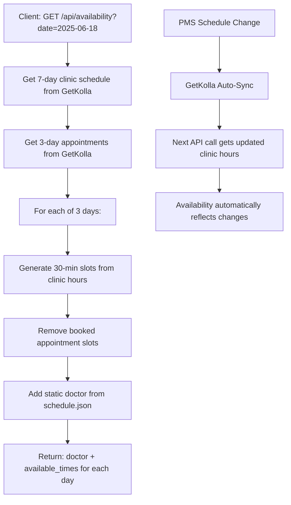

# Simplified GetKolla Availability Integration

## Problem Statement

**"Sometimes doctors can change schedules on their PMS, and they need to reflect here right away"** (e.g., Dr. Hanna may be on holiday with another doctor filling in for her).

## Simplified Solution

Based on the GetKolla founder's recommendation, we implemented a **single, simple API** that:

1. **Gets clinic schedule from GetKolla** (7 days to ensure data availability)
2. **Gets appointments from GetKolla** (for the 3 requested days)
3. **Calculates free slots** = Clinic hours - Booked appointments  
4. **Uses static doctor assignments** from local schedule.json
5. **Returns 3 days** (requested date + next 2 days)

## Single API Endpoint

### Get 3-Day Availability
```http
GET /api/availability?date=2025-06-18
```

**Simple Request:**
- Just provide a start date
- Returns that day + next 2 days
- No complex parameters needed

**Response Format:**
```json
{
  "success": true,
  "requested_date": "2025-06-18",
  "dates_covered": ["2025-06-18", "2025-06-19", "2025-06-20"],
  "availability": {
    "2025-06-18": {
      "date": "2025-06-18",
      "day_name": "Wednesday", 
      "doctor": "Dr. Parmar",
      "clinic_hours": {"start": "09:00", "end": "17:00"},
      "total_slots": 16,
      "booked_slots": 3,
      "free_slots": 13,
      "available_times": ["09:00", "09:30", "10:00", "10:30", "11:00"],
      "status": "open"
    },
    "2025-06-19": {
      "date": "2025-06-19",
      "day_name": "Thursday",
      "doctor": "Dr. Hanna", 
      "clinic_hours": {"start": "09:00", "end": "18:00"},
      "total_slots": 18,
      "booked_slots": 1,
      "free_slots": 17,
      "available_times": ["09:00", "09:30", "10:00"],
      "status": "open"
    },
    "2025-06-20": {
      "date": "2025-06-20",
      "day_name": "Friday",
      "doctor": null,
      "clinic_hours": null,
      "total_slots": 0,
      "booked_slots": 0, 
      "free_slots": 0,
      "available_times": [],
      "status": "closed"
    }
  },
  "total_days": 3,
  "generated_at": "2025-06-18T10:30:00"
}
```

## How It Solves The Problem

### 🔄 **Automatic Schedule Updates**
- GetKolla automatically syncs clinic schedule changes from PMS
- When doctors change schedules → GetKolla reflects it immediately
- No manual updates needed

### 👥 **Doctor Substitutions Handled** 
- Dr. Hanna on holiday → Clinic schedule shows available hours
- Dr. Smith covering → Appointments show actual provider assignments
- Static doctor mapping from local schedule.json for display

### 📊 **Simple Logic**
```
Free Slots = Clinic Hours - Booked Appointments
```
- No complex blockout logic
- No provider-specific filtering  
- Just pure availability calculation

## Implementation

### File Structure
```
backend2/
├── services/
│   └── simple_availability_service.py  # New simplified service
├── main.py                             # Single API endpoint
└── test_simple_availability.py         # Testing script
```

### Key Features

1. **SimpleAvailabilityService Class**
   - Gets 7-day clinic schedule from GetKolla
   - Gets 3-day appointments from GetKolla  
   - Calculates free 30-minute slots
   - Applies static doctor assignments

2. **Single API Endpoint**
   - `GET /api/availability?date=YYYY-MM-DD`
   - Returns 3 days of data
   - Easy frontend integration

3. **Automatic Data Sync**
   - Real-time clinic hours from GetKolla
   - Real-time appointments from GetKolla
   - Handles PMS schedule changes automatically

## Testing

Run the test script:

```bash
cd backend2
python test_simple_availability.py
```

This will:
- Show usage examples
- Display sample response format  
- Test the live API if backend is running
- Verify 3-day availability calculation

## Business Logic Flow



## Benefits

✅ **Simple Integration** - One API call, easy response format  
✅ **Real-time Sync** - GetKolla handles PMS changes automatically  
✅ **Doctor Flexibility** - Handles substitutions and schedule changes  
✅ **No Complex Logic** - Just clinic hours minus appointments  
✅ **3-Day View** - Perfect for booking interfaces  
✅ **Static Doctor Display** - Consistent doctor names from local config  

## Usage Examples

### JavaScript Frontend
```javascript
fetch('/api/availability?date=2025-06-18')
  .then(response => response.json())
  .then(data => {
    Object.entries(data.availability).forEach(([date, dayData]) => {
      console.log(`${date}: Dr. ${dayData.doctor} - ${dayData.free_slots} slots`);
      dayData.available_times.forEach(time => {
        console.log(`  Available: ${time}`);
      });
    });
  });
```

### Python Client
```python
import requests

response = requests.get('http://localhost:8000/api/availability?date=2025-06-18')
data = response.json()

for date, day_data in data['availability'].items():
    print(f"{date}: {day_data['doctor']} - {day_data['free_slots']} slots")
```

This simplified approach gives you exactly what you need: **real-time availability that automatically reflects PMS changes, with simple doctor assignments and easy frontend integration**.
